# 3D 实时站点大世界分层验证目标

来源：`REQUIREMENTS.md` 与 `TODO.md`

本文档定义每一层必须达到的最小验证目标。每一层都写清楚三件事：

- 进入本层前，上一层必须已经达到什么。
- 本层需要其他同学或外部系统准备什么。
- 本层最小验证目标是什么。

推进规则：

- 上一层没有通过，不进入下一层。
- 每一层都必须保留上一层能力。
- 如果新增能力破坏上一层能力，先修复回归再继续。
- 依赖外部服务的层，必须先有模拟版本。
- 每一层的问题、修复和验证过程记录在该层目录的 `debug.md`，路径为 `validation/layer-N/debug.md`。
- 真实设备控制只能在权限和安全边界明确后接入。
- 涉及凭据、token、设备密钥时，只记录配置位置，不记录值。

## Layer 0：静态兜底层

目标：即使 3D 不可用，站点仍然可进入、可理解、可导航。

进入本层前必须满足：

- 无上一层要求。
- 已确认 `gluepudding` 是总站入口。
- 已确认核心体验最终要做成 3D 实时大世界，而不是跳转式导航。

需要其他同学或外部系统准备：

- 暂不依赖其他同学。
- 暂不依赖后端、RDK、WebRTC、IoT 或五子棋真实能力。

本层最小验证目标：

- `gluepudding` 首页能打开。
- WebGL 不可用时显示 2D 兜底内容。
- 兜底内容包含占卜屋、实验室、五子棋三个入口说明。
- 兜底内容不暴露任何 token、密钥、设备地址或内部错误。
- 页面在桌面端和移动端都没有文字重叠。

通过标准：

- 禁用 WebGL 或模拟 3D 初始化失败时，用户不会看到空白页。
- 用户能看懂这是一个 3D 大世界入口，并知道哪些能力暂不可用。

用户实机确认：

- 2026-07-07：用户确认 Layer 0 OK。

实机截图：

- 桌面端 WebGL 兜底入口：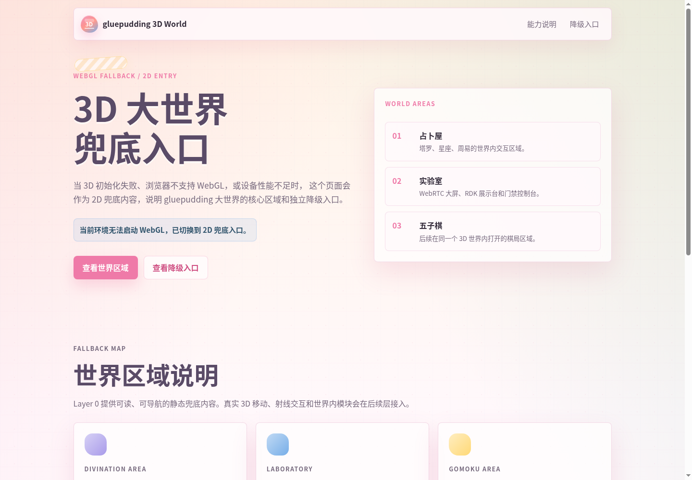
- 移动端 WebGL 兜底入口：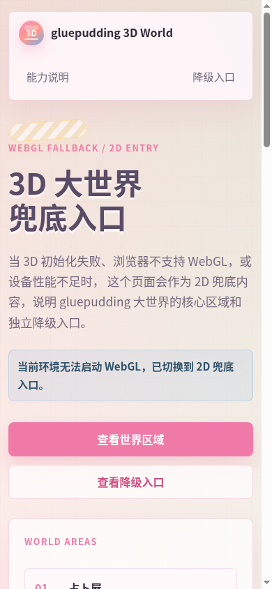

调试记录：

- [Layer 0 debug.md](validation/layer-0/debug.md)

## Layer 1：3D 世界存活层

目标：先证明大世界本身能渲染和运行。

进入本层前必须满足：

- Layer 0 已通过。
- 静态兜底页可用。
- 3D 初始化失败时能回落到静态兜底。

需要其他同学或外部系统准备：

- 暂不需要建模同学交付正式 GLB。
- 暂不需要后端接口。
- 暂不需要真实 WebRTC、RDK 或 IoT 服务。

本层最小验证目标：

- 进入 `gluepudding` 首页后显示 3D 场景。
- 场景不是空白画布。
- 地面、灯光、相机、玩家占位体可见。
- 没有外部服务时，世界仍然能加载。
- 3D 初始化错误能被捕获，并回落到 Layer 0。

通过标准：

- 刷新页面 3 次，3D 场景都能稳定出现。
- 浏览器控制台没有阻断运行的未捕获错误。

用户实机确认：

- 2026-07-07：用户确认 Layer 1 OK。

实机截图：

- 桌面端第一人称大场地：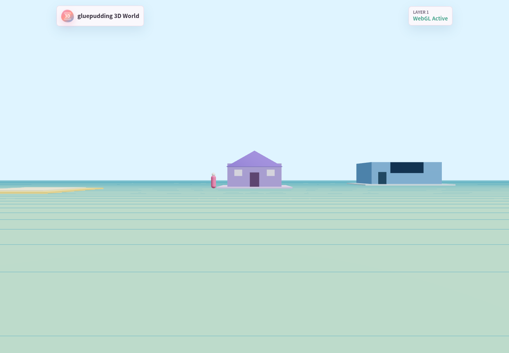
- 移动端第一人称大场地：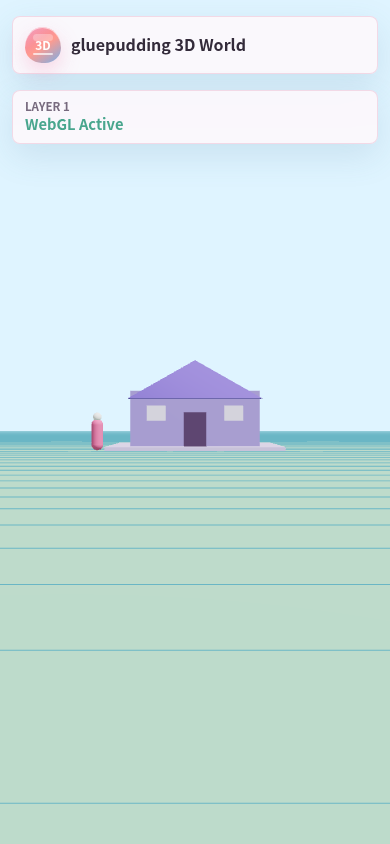

调试记录：

- [Layer 1 debug.md](validation/layer-1/debug.md)

## Layer 2：移动和相机层

目标：证明用户可以在世界中行动。

进入本层前必须满足：

- Layer 1 已通过。
- 3D 世界能稳定渲染。
- 兜底层仍然可用。

需要其他同学或外部系统准备：

- 暂不需要正式场景模型。
- 暂不需要真实业务接口。
- 如果建模同学有初版空间尺寸建议，可以用于出生点和区域距离参考，但不是阻塞项。

本层最小验证目标：

- `WASD` 可以移动玩家。
- `Shift` 可以让玩家疾跑。
- `Space` 可以让玩家跳跃并落回地面。
- 相机能跟随或稳定观察玩家。
- 玩家移动不依赖帧率。
- 玩家不会一开始就卡进模型或掉出地面。
- `ESC` 不会导致页面异常。

通过标准：

- 用户可以从出生点移动到占卜屋、实验室、棋盘三个区域附近。
- 移动过程中场景不闪烁、不黑屏、不丢失相机目标。

调试记录：

- [Layer 2 debug.md](validation/layer-2/debug.md)

## Layer 3：世界内交互层

目标：证明大世界不是静态展示，而是可交互空间。

进入本层前必须满足：

- Layer 2 已通过。
- 玩家能稳定移动到三个区域附近。
- 相机和移动不会阻塞交互检测。

需要其他同学或外部系统准备：

- 暂不需要真实后端。
- 暂不需要正式模型。
- 建模同学如果能提供交互点命名建议，可以后续映射；本层先用代码固定坐标。

本层最小验证目标：

- 交互对象有统一配置。
- 靠近占卜屋显示提示。
- 靠近实验室显示提示。
- 靠近棋盘显示提示。
- `E` 可以触发区域级交互。
- 准星命中对象后，左键可以触发对象级选择。
- 被选中的对象有可见高亮。
- 打开面板时暂停移动，关闭后恢复移动。

通过标准：

- 用户能在不跳转页面的情况下，分别触发三个区域的世界内交互。
- 左键选中一个对象后，界面能明确显示“当前选中了什么”。

用户实机确认：

- 2026-07-07：用户确认 Layer 3 OK。

实机截图：

- 桌面端世界内交互提示和面板：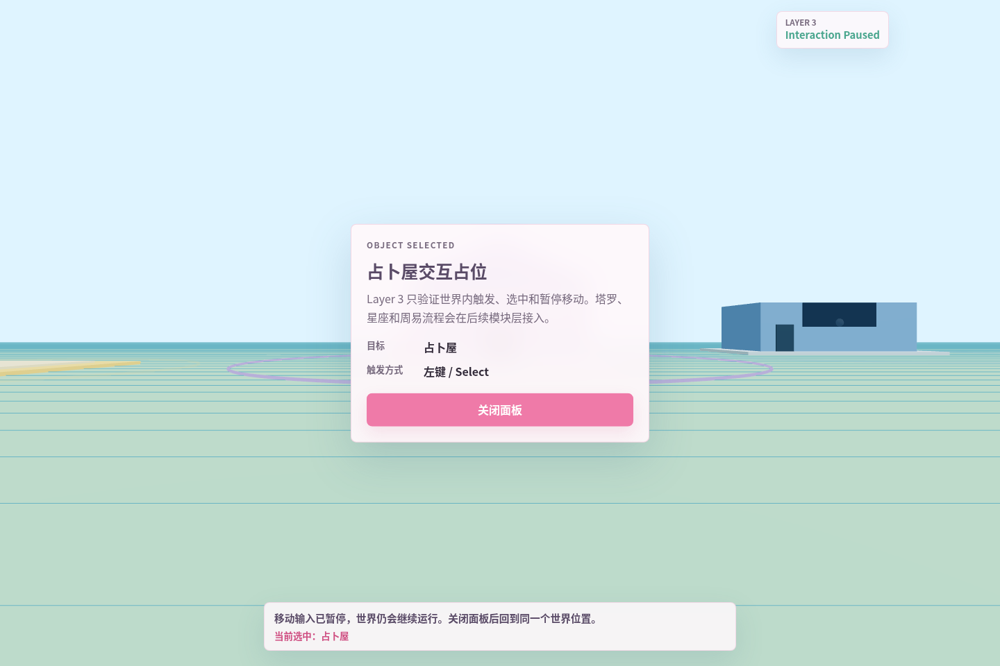
- 移动端世界内交互提示和移动端按钮：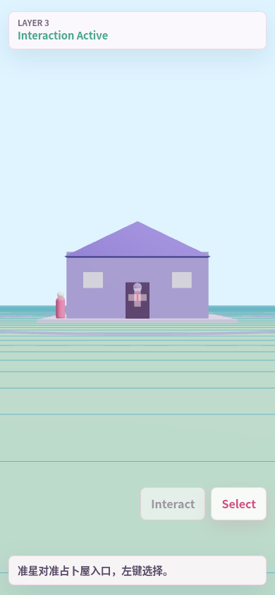

调试记录：

- [Layer 3 debug.md](validation/layer-3/debug.md)

## Layer 4：模块外壳层

目标：证明占卜屋、实验室、五子棋都能作为常驻 3D 世界模块表面直接操作，而不是整页跳转或打开 DOM 浮层。

进入本层前必须满足：

- Layer 3 已通过。
- 三个区域都能触发交互。
- 玩家移动、准星命中和左键选择不会互相阻塞。

需要其他同学或外部系统准备：

- 暂不需要真实业务数据。
- 暂不需要真实推流或设备。
- 如果其他同学已有接口草案，可以开始对齐字段，但本层不阻塞。

本层最小验证目标：

- 占卜屋模块常驻贴在占卜屋入口表面。
- 实验室模块常驻贴在实验室大屏表面。
- 五子棋模块常驻贴在棋盘附近的 3D 表面。
- 每个模块都有加载中、错误、离线三类状态。
- 准星命中模块状态控件后，左键或 `E` 能在 Canvas 内切换状态。
- 任一模块报错不会导致整个世界崩溃。
- 模块操作不会主动退出 Pointer Lock，也不会暂停玩家移动。

通过标准：

- 连续操作三个模块的状态控件，玩家仍然停留在原世界中。
- 模块表面操作时鼠标焦点保持在 3D Canvas。
- 地址栏不发生整页跳转。

用户实机确认：

- 2026-07-08：用户确认 Layer 4 OK，可以进入 Layer 4.5 资源接入准备层。

验证截图：

- 桌面端 3D 模块表面和状态切换：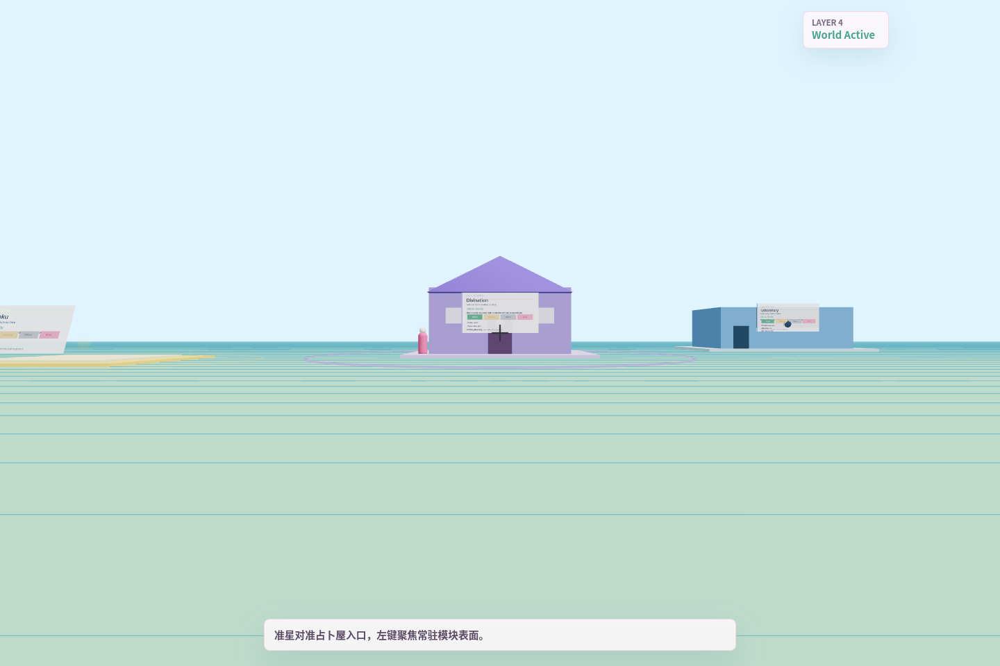
- 移动端 3D 模块表面和状态切换：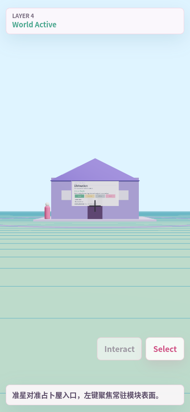

调试记录：

- [Layer 4 debug.md](validation/layer-4/debug.md)

## Layer 4.5：资源接入准备层

目标：在进入真实占卜屋业务接入前，先确认并接入 `resources/` 里的大场景资源，避免把资源整理、模型比例、地形移动和占卜业务接入混在同一层。

进入本层前必须满足：

- Layer 4 已通过。
- 常驻模块表面、准星和 Canvas 内交互口径已确认。

已有资源输入：

- 世界大场景候选资源：`resources/float-island-low-ploy.zip`。
- 占卜屋模型资源压缩包：`resources/fortune.zip`。
- 占卜屋模型资源解压目录：`resources/fortune/`。
- 占卜屋现有功能实现代码：`resources/feature-implementation/`。
- 不读取、不复制、不记录 `resources/feature-implementation/.env` 的内容。

本层最小验证目标：

- 确认大场景资源下一步先作为世界场景资产接入，而不是放到占卜业务层处理。
- 确认占卜屋代码下一步作为 Layer 5 输入，优先复用类型、API 适配和 mock 流程。
- 明确 `resources/feature-implementation/node_modules/`、`resources/feature-implementation/dist/` 和 `.env` 不作为主工程源码接入输入。
- 将浮岛 GLB 作为世界基础地形接入，并保留旧圆形地板作为 GLB 加载失败兜底。
- 玩家移动高度来自 GLB 主岛体最高朝上命中面，不再固定为 `y=0`。
- 出生点、占卜屋、实验室和五子棋区域放在浮岛可行走空地上。

通过标准：

- `TODO.md` 和 `Tech-Spec.md` 已记录资源路径、接入顺序和不接入范围。
- `app/nav-world/public/models/world/island.glb` 存在；当前暂不使用 Git LFS 追踪 `.glb`。`app/frontend/models/world/island.glb` 作为构建输出不进入 Git。
- `npm run build` 和 `npm run assets:check` 通过。
- 桌面端和移动端截图显示玩家位于 GLB 浮岛上方草地，而不是旧圆形地板或下层平面。

验证截图：

- 桌面端 GLB 浮岛地形和常驻模块表面：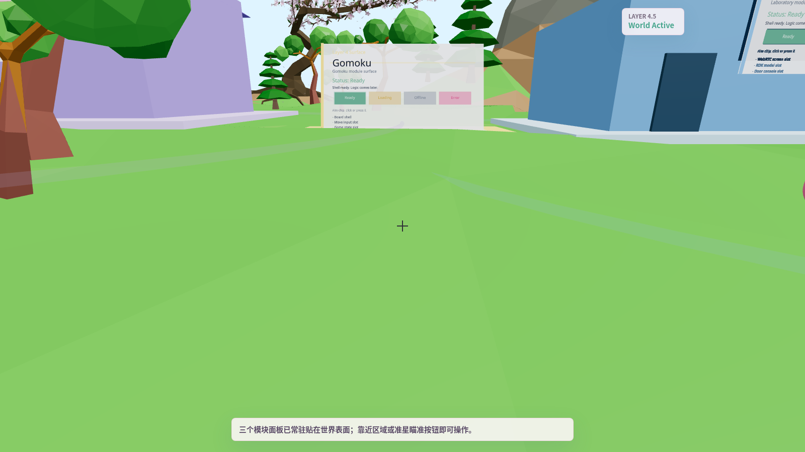
- 移动端 GLB 浮岛地形和触屏操作按钮：
- 桌面端首次加载提示：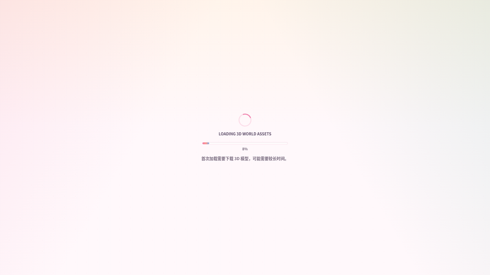
- 移动端首次加载提示：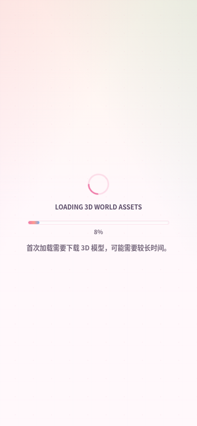

调试记录：

- [Layer 4.5 debug.md](validation/layer-4-5/debug.md)

## Layer 5：占卜屋模型摆放验收层

目标：确认占卜屋外壳、室内模型、三类建模区域和内容承载屏已经放到规定位置。本层不实现占卜业务交互。

进入本层前必须满足：

- Layer 4 已通过。
- Layer 4.5 已完成资源接入准备。
- 占卜屋区域可以进入和观察。
- 模块错误不会影响世界运行。

需要其他同学或外部系统准备：

- 后端同学暂不需要提供真实接口。
- 建模同学暂不需要提供额外交互命名或最终业务动画。
- 已有 `resources/fortune/` 作为占卜屋模型资源输入。`resources/feature-implementation/` 中的类型、API 适配和 mock 流程留到 Layer 8 再接入。

本层最小验证目标：

- 占卜屋帐篷外壳、魔法阵和地板能稳定显示。
- 塔罗桌、烛台、水晶球、塔罗样始牌放在桌面规定位置。
- 星座轮盘放在 `X=-6, Z=0` 的地板区域。
- 周易桌、签筒、竹签、铜钱和太极图放在规定位置。
- 原占卜屋 Layer 4 大屏已隐藏。
- 星座、塔罗、周易三个区域后方各有一块空白内容屏，作为后续内容承载面。
- 占卜屋内不显示无关交互提示球或明显调试占位体。
- GLB 资源请求返回有效 `model/gltf-binary`，不会把 HTML 当模型加载。

通过标准：

- 用户实机确认：所有本层要求的建模都已放置于规定位置。
- 本层不验收点击、选中、高亮、卡牌翻面、星座输入、周易起卦、结果展示、API 调用或 mock 流程。
- 所有占卜屋交互逻辑，包括点击逻辑，下放到 Layer 8 制作和验收。

Layer 5A 模型接入切片：

- 本切片只接入占卜屋模型外壳和室内轻量道具，不实现占卜业务逻辑。
- 正常首屏不请求 `models/fortune/` 或 `textures/`。
- `?fortuneAssets=shell` 只加载帐篷外壳。
- `?fortuneAssets=interior` 加载帐篷、魔法阵、桌面、星座和周易轻量 GLB，不加载完整塔罗牌面贴图。

用户实机确认：

- 2026-07-08：用户确认 Layer 5 目标缩小为模型摆放验收；所有建模已放置于规定位置；所有交互逻辑均未做并下放到 Layer 8；Layer 5 确认验收。

验证截图：

- 桌面端占卜屋模型外壳：
- 移动端占卜屋模型外壳：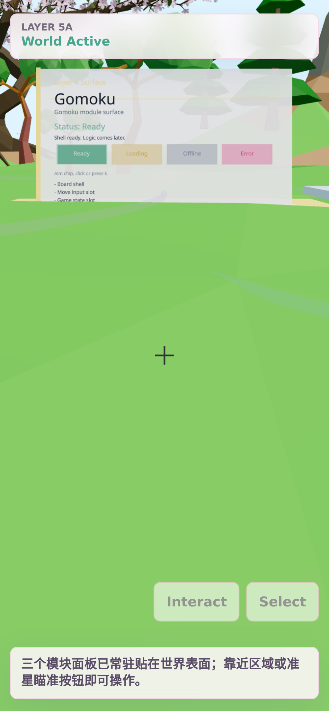
- 桌面端占卜屋室内道具：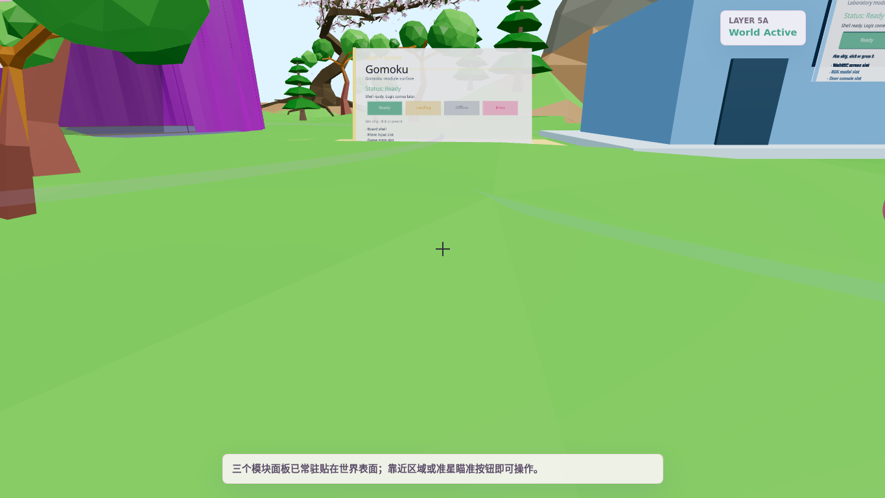
- 移动端占卜屋室内道具：

调试记录：

- [Layer 5 debug.md](validation/layer-5/debug.md)

## Layer 5.5：视觉渲染基线层

目标：在继续接入实验室、五子棋和占卜交互前，先把大世界的基础光照、屏幕材质和低成本高画质感统一到可持续的视觉基线。

进入本层前必须满足：

- Layer 5 已通过。
- 占卜屋模型摆放已经验收，不能在本层重新调整模型坐标。
- 世界内移动、准星、实验室模块表面和五子棋模块表面仍可用。

需要其他同学或外部系统准备：

- 不需要后端、WebRTC、RDK、IoT 或五子棋真实能力。
- 不需要新增模型资源或后处理依赖。
- 如建模同学后续提供烘焙贴图、HDRI 或压缩模型，可进入 Layer 13 或后续美术专项再接入。

本层最小验证目标：

- 3D renderer 使用 sRGB 输出、ACES tone mapping 和软阴影配置。
- 世界光照从高环境光改为低环境光、暖色主光和柔和天光。
- 主光阴影范围覆盖出生点、占卜屋、实验室和五子棋附近，阴影不出现大面积闪烁。
- 占卜屋三块内容屏从白色基础面片改为带轻微发光的深色屏幕材质。
- 实验室和五子棋常驻模块面板具有屏幕质感，按钮和文字仍然可读。
- 占卜屋内部有低强度暖光、紫色辅助光和星座侧弱冷光。
- 不新增 Bloom、SSAO、WebGPU 或真实 path tracing。
- 不实现占卜、实验室或五子棋业务交互。

通过标准：

- `npm run assets:fortune:check`、`npm run build` 和 `npm run assets:check` 通过。
- 首页能进入 3D 世界，不进入 2D fallback。
- 桌面端和移动端截图没有黑屏、过曝、明显文字重叠或 HUD / 触屏按钮遮挡主要内容。

验证截图：

- 桌面端视觉渲染基线：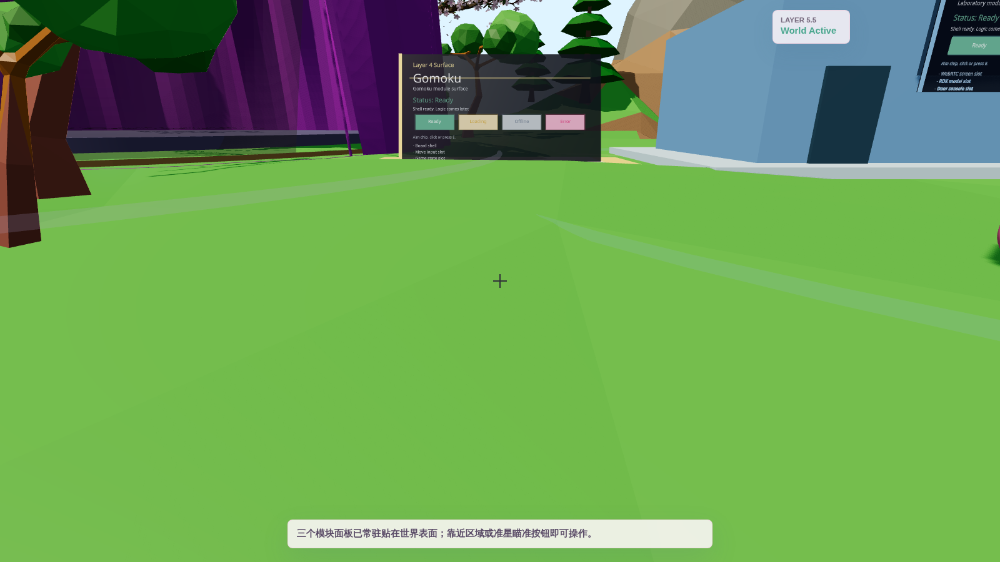
- 移动端视觉渲染基线：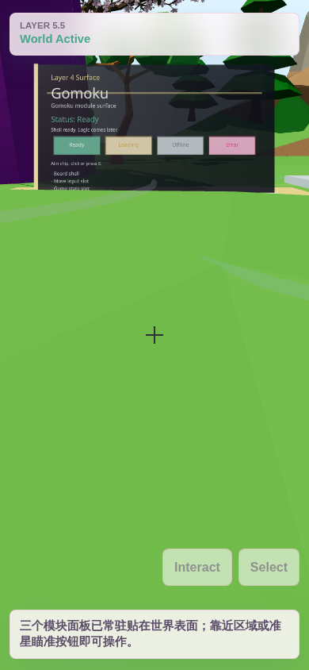

调试记录：

- [Layer 5.5 debug.md](validation/layer-5-5/debug.md)

## Layer 6：世界内五子棋模拟层

目标：证明五子棋能在大世界内打开和操作，不整页跳转。

进入本层前必须满足：

- Layer 5.5 已通过。
- 占卜屋模型摆放和实验室模块表面仍然可用。
- 五子棋模块能在世界内打开和关闭。

需要其他同学或外部系统准备：

- 暂不需要重构现有五子棋。
- 如果游戏同学能提供五子棋规则或 AI 模块边界说明，可以提前评估复用方式。
- 暂不需要原生 3D 棋子模型。

本层最小验证目标：

- 草地棋盘或棋桌区域可交互。
- 触发后打开世界内棋局面板。
- 棋局面板不会整页跳转。
- 面板打开后，大世界移动控制暂停。
- 面板关闭后，大世界移动控制恢复。
- 第一版至少能展示棋盘并完成一次落子。

通过标准：

- 用户可以从大世界进入棋局、落子、关闭棋局，再回到原世界。
- 键盘事件不会同时控制棋局和玩家移动。

调试记录：

- [Layer 6 debug.md](validation/layer-6/debug.md)

## Layer 7：实验室模拟层

目标：证明实验室能承载实时能力的前端壳，不依赖真实设备。

进入本层前必须满足：

- Layer 6 已通过。
- 占卜屋模型摆放验收已完成；占卜屋业务交互尚未要求可用。
- 世界内五子棋模拟能力仍然可用。
- 实验室模块常驻在世界表面并可用准星操作。

需要其他同学或外部系统准备：

- WebRTC 同学暂不需要提供真实推流。
- RDK 同学暂不需要提供真实世界模型。
- IoT 同学暂不需要提供真实门禁接口。
- 如果有设备状态字段草案，可以用于模拟状态设计。

本层最小验证目标：

- 实验室有 3D 大屏。
- 大屏能显示模拟视频、占位动态画面或本地测试流。
- RDK 展示台能显示静态 GLB 或模拟模型。
- 门禁控制台能显示模拟门禁状态。
- 开门按钮需要二次确认。
- 模拟开门结果能展示成功和失败两种反馈。
- 设备离线状态能在世界内显示。

通过标准：

- 不接真实 WebRTC、RDK、IoT 服务时，实验室仍然能完整演示。
- 用户能理解大屏、模型台、门禁台分别代表什么能力。

用户实机确认：

- 2026-07-09：用户确认实验室模拟层验收通过；Layer 6 / Layer 7 编号更正后，该确认归属 Layer 7。

调试记录：

- [Layer 7 debug.md](validation/layer-7/debug.md)

## Layer 8：占卜屋交互与真实占卜接口层

目标：在占卜屋模型摆放已验收后，集中制作和验证占卜屋交互逻辑、模拟流程和真实占卜接口。

进入本层前必须满足：

- Layer 7 已通过。
- Layer 5 的占卜屋模型和三块空白内容屏仍在规定位置。
- 接口失败时需要在本层建立世界内错误和模拟兜底。

需要其他同学或外部系统准备：

- 后端同学需要提供占卜服务地址。
- 后端同学需要提供 `GET /api/fortune/health`。
- 后端同学需要提供 `POST /api/fortune/zodiac`。
- 后端同学需要提供 `POST /api/fortune/tarot`。
- 后端同学需要提供 `POST /api/fortune/iching`。
- 后端返回结构需要匹配占卜类型定义；当前前端文件为 `app/nav-world/src/modules/divination/types.ts`。

本层最小验证目标：

- 创建占卜屋真实场景区域交互。
- 星座台、塔罗桌和周易桌可以被准星或移动端替代方式命中。
- 准星命中某张塔罗牌后左键点击，该牌被选中并高亮。
- 本次 PR 先验收 `three_card` 三张牌流程；`single` 模式作为后续增强，不作为本次合并阻塞项。
- 选牌结果在真实接口不可用时来自模拟数据。
- 结果能显示到 Layer 5 预留的世界内内容屏或等价世界内承载面。
- 星座和周易至少有基础面板和模拟结果。
- 周易展示时使用 `result.lines.slice().reverse()`。
- `GET /api/fortune/health` 可检测服务状态。
- `POST /api/fortune/zodiac` 返回结构匹配类型。
- `POST /api/fortune/tarot` 返回结构匹配类型。
- `POST /api/fortune/iching` 返回结构匹配类型。
- 接口失败时回到模拟数据或显示世界内错误。
- 接口错误不影响玩家移动和其他模块。

通过标准：

- 真实接口可用时显示真实结果。
- 真实接口关闭时，占卜屋仍然能用模拟数据完成星座、三张塔罗、周易六爻和抽签演示。
- 占卜屋点击、选中、高亮、卡牌翻面、输入和结果展示均在世界内完成，不整页跳转。
- 本次 PR 的用户可见画面由用户手测确认；Codex 合并侧至少完成类型检查、资源检查和构建验证。

## Layer 9：真实 WebRTC 层

目标：把真实推流接到实验室大屏，同时保持失败可降级。

进入本层前必须满足：

- Layer 8 已通过。
- 实验室模拟大屏可用。
- 真实占卜接口接入失败不会影响实验室。

需要其他同学或外部系统准备：

- WebRTC 同学需要提供信令服务地址。
- WebRTC 同学需要提供流标识。
- WebRTC 同学需要提供 ICE 配置来源。
- WebRTC 同学需要说明无权限、断流、设备离线等错误码。
- 认证同学需要说明当前登录态如何影响推流权限。
- 不提供任何真实密钥到文档中，只提供配置位置。

本层最小验证目标：

- WebRTC 配置来自环境变量或安全配置，不硬编码凭据。
- 信令连接失败时显示连接失败状态。
- 无权限时显示无权限状态。
- 成功拿到 `MediaStream` 后，视频能显示到 3D 大屏。
- 断流后大屏能显示离线状态。
- 大屏放大查看不会打断主世界。

通过标准：

- 真实推流在线时，大屏显示实时画面。
- 真实推流离线时，实验室仍然可进入，其他能力不受影响。

## Layer 10：真实 RDK 模型层

目标：把 RDK 输出接进实验室展示台。

进入本层前必须满足：

- Layer 9 已通过。
- RDK 展示台模拟模型可用。
- WebRTC 真实流失败时不会影响 RDK 展示台。

需要其他同学或外部系统准备：

- RDK 同学需要提供模型数据来源。
- RDK 同学需要提供静态快照或 GLB 样例。
- RDK 同学需要提供实时更新方式，例如 WebSocket、轮询接口或文件刷新机制。
- RDK 同学需要提供节点状态字段说明。
- RDK 同学需要提供数据更新时间或版本字段。

本层最小验证目标：

- 能加载 RDK 静态快照或模型文件。
- 能通过适配层接收 RDK 更新。
- 展示台显示模型更新时间。
- 数据格式变化只影响适配层，不影响渲染组件。
- 数据不可用时显示最近一次快照或占位模型。

通过标准：

- RDK 数据更新后，实验室展示台能反映变化。
- RDK 服务不可用时，大世界和实验室不崩溃。

## Layer 11：真实门禁控制层

目标：在权限和安全边界明确后，再接真实门禁控制。

进入本层前必须满足：

- Layer 10 已通过。
- 门禁控制台模拟流程可用。
- 认证状态可以在前端被安全读取。
- WebRTC 和 RDK 失败不会影响门禁面板打开。

需要其他同学或外部系统准备：

- IoT 同学需要提供查询门禁状态接口。
- IoT 同学需要提供开门接口。
- IoT 同学需要提供设备在线状态接口。
- 认证同学需要提供登录态接口和角色权限说明。
- 运维或后端同学需要确认生产环境接口代理路径。
- 不提供任何真实 token、密码、私钥或设备密钥到前端和文档。

本层最小验证目标：

- 能读取登录态。
- 能判断当前用户是否有门禁权限。
- 无权限时不能发送开门请求。
- 开门前必须二次确认。
- 真实开门请求不包含前端硬编码密钥。
- 成功、失败、离线、无权限都能在世界内显示。
- 错误信息不泄露敏感数据。

通过标准：

- 有权限用户确认后可以触发真实开门流程。
- 无权限用户无法触发真实开门请求。
- 门禁接口失败不影响 3D 世界运行。

## Layer 12：真实五子棋集成层

目标：把现有五子棋能力稳定放进世界内。

进入本层前必须满足：

- Layer 11 已通过。
- Layer 6 世界内五子棋模拟层可用。
- 真实门禁控制的权限和失败状态不会影响五子棋模块。

需要其他同学或外部系统准备：

- 游戏同学或项目维护者需要说明现有五子棋是否允许同源嵌入。
- 如果不能嵌入，需要提供规则、AI、棋盘状态的可复用边界。
- 如果有资源文件路径依赖，需要说明部署路径。
- 如果要保留棋局记录，需要提供存储或接口方案；不是本层阻塞项。

本层最小验证目标：

- 明确采用内嵌页面、同源代理、还是逻辑抽离。
- 棋局打开时不整页跳转。
- 棋局可以正常落子。
- AI 回合可以正常返回。
- 棋局关闭后世界控制恢复。
- 棋局错误显示在世界内。

通过标准：

- 用户能在世界内完成至少一局基础对弈流程。
- 五子棋模块异常不会影响占卜屋和实验室。

验收状态：

- 2026-07-09：用户实机确认 Layer 12 验收通过。

模型资产预览截图：

- 原生五子棋 GLB 模型桌面端预览：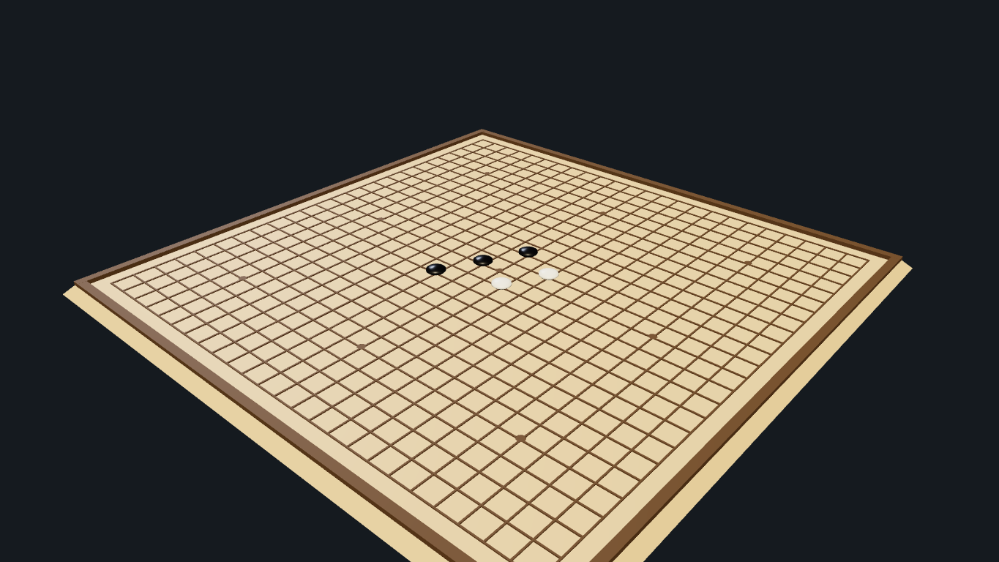
- 原生五子棋 GLB 模型移动端预览：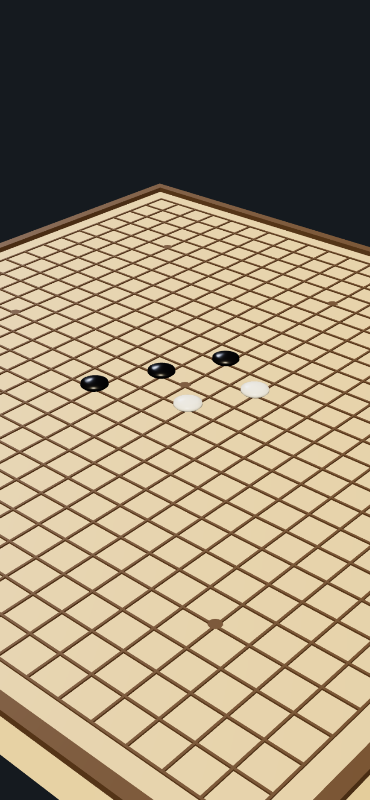

交互外壳验证截图：

- 桌面端 `G` 展开 / 移动、`H` 收回提示：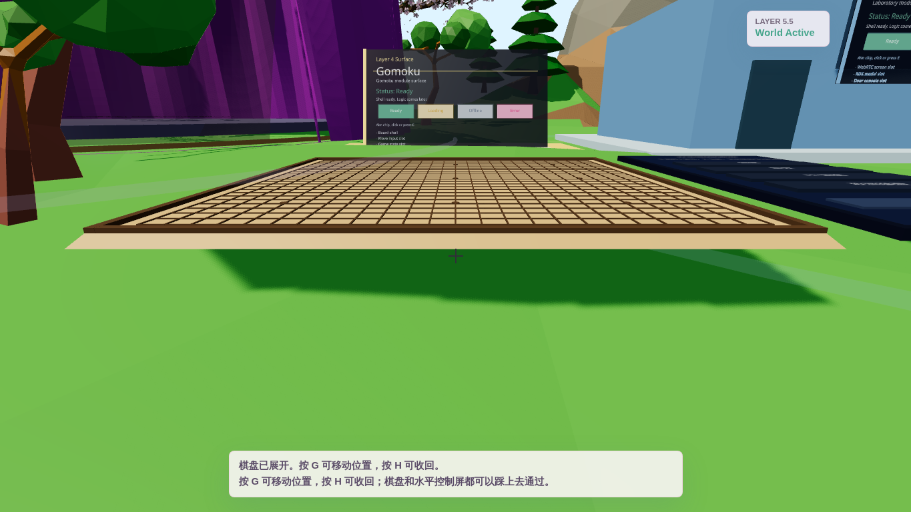
- 移动端 `G` 展开 / 移动、`H` 收回提示：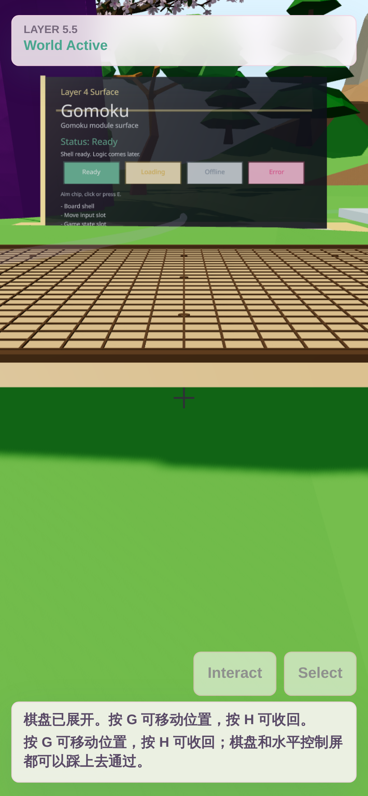

真实对弈验证截图：

- 桌面端世界内人机对弈：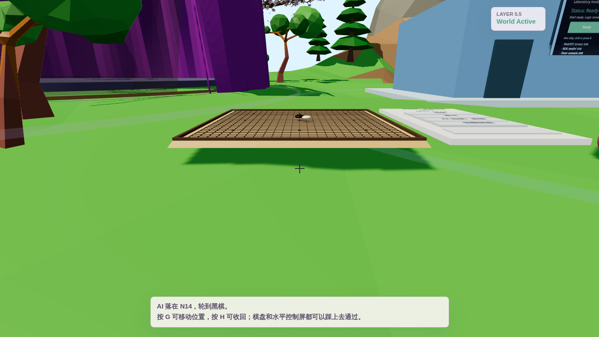
- 移动端世界内人机对弈：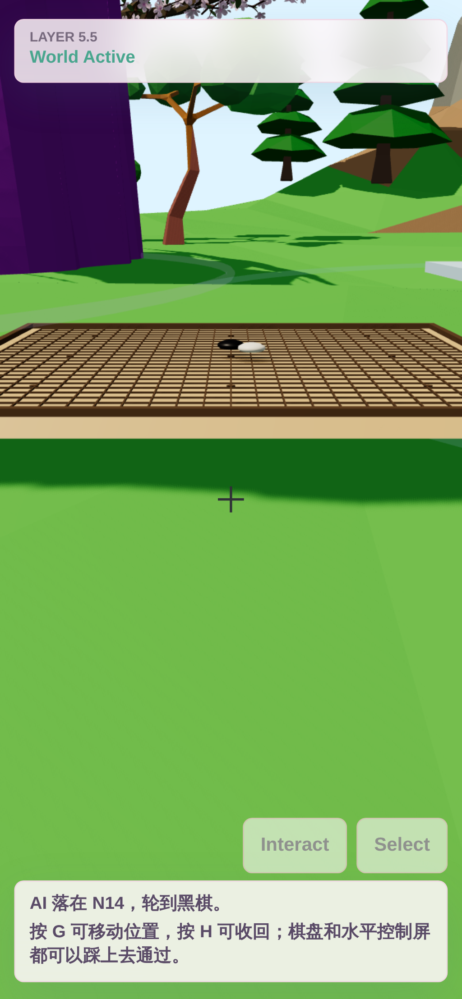

尺寸调整验证截图：

- 桌面端缩小后的棋盘和棋子：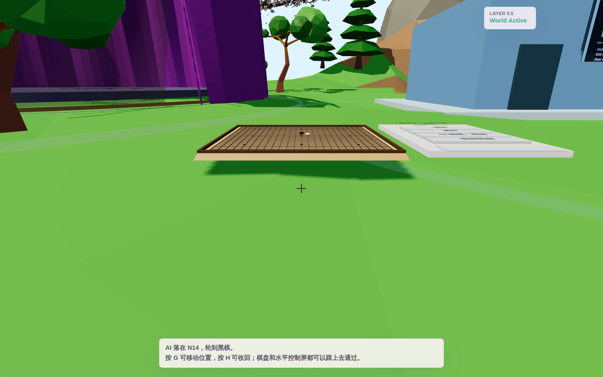
- 移动端缩小后的棋盘和棋子：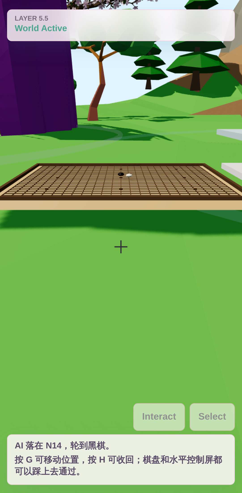

控制屏文字修复截图：

- 桌面端控制屏文字近景：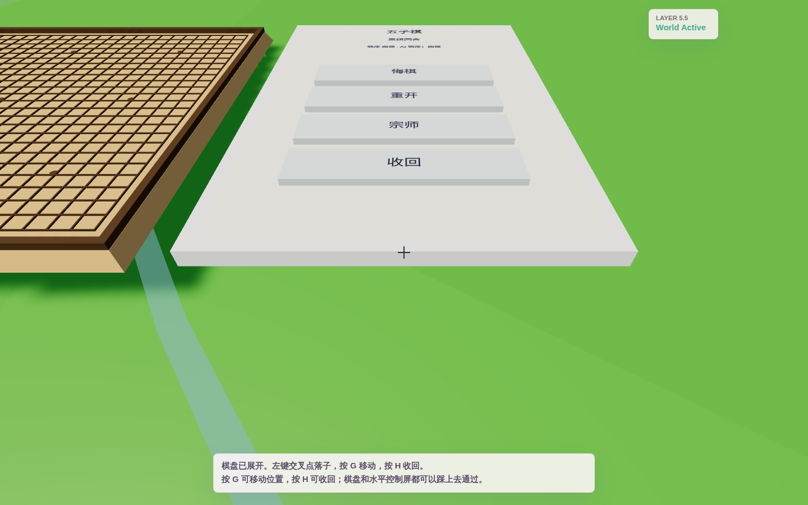
- 移动端控制屏文字近景：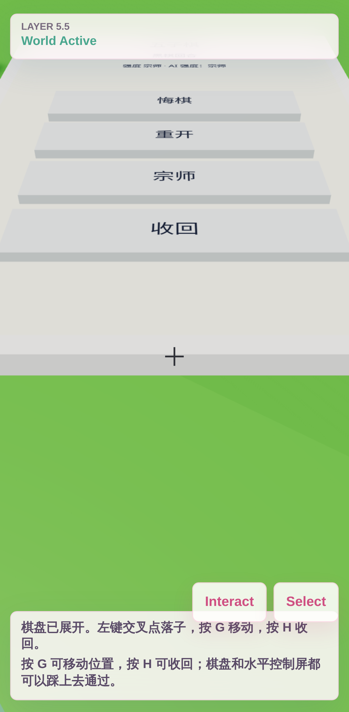

棋子贴地验证截图：

- 桌面端远景棋子贴地：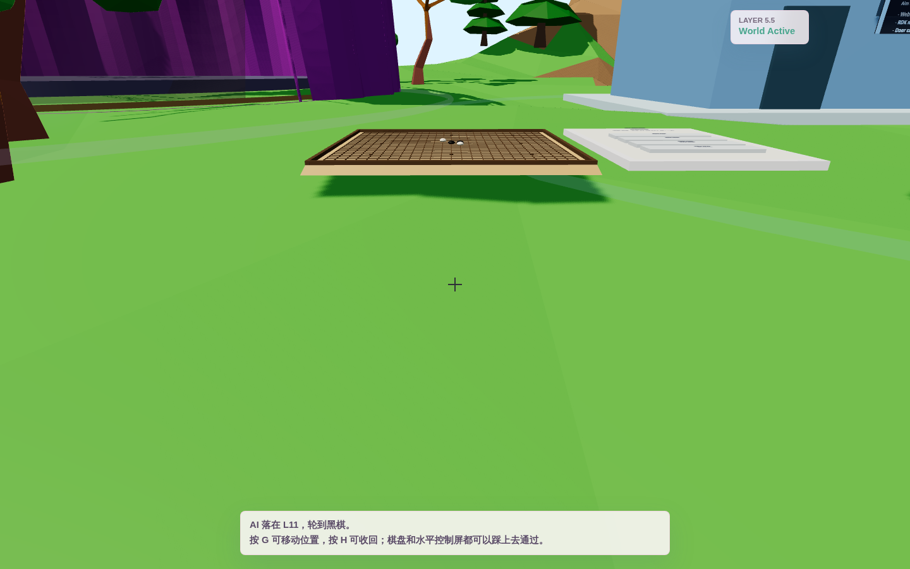
- 移动端棋子贴地：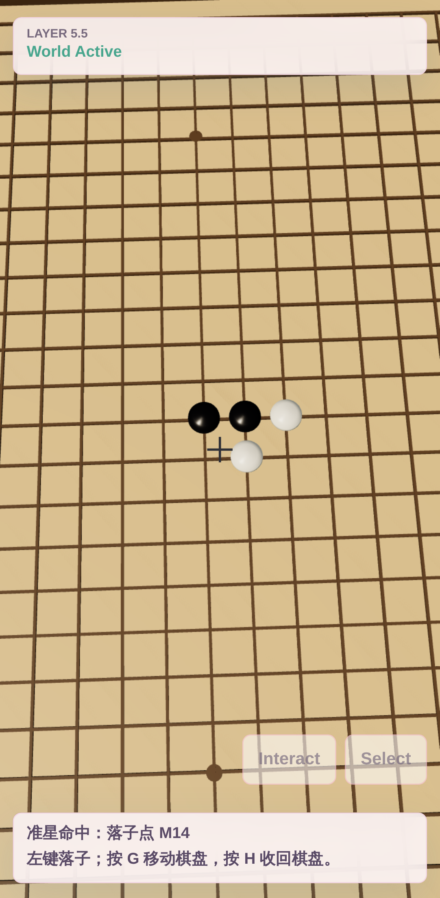

真实逻辑验证：

- 2026-07-09：采用逻辑抽离路线，移植 `resources/gomoku-ai-academy-submission/iphone/ai_worker.js` 的 25x25 AI / 威胁判断 / 搜索解释能力到 Vite TypeScript Worker。
- 2026-07-09：世界内原生 3D 五子棋支持玩家执黑、AI 执白、默认宗师难度、左键交叉点落子、AI 自动回应、胜负检测、五连线高亮、悔棋、重开、AI 强度切换和收回棋盘。
- 2026-07-09：`G` 展开 / 移动、`H` 收回均保留当前棋局；只有“重开”清空棋局。
- 2026-07-09：棋盘整体进一步缩小到约 `2.603m x 2.603m`，格距 `0.096m`；棋子直径缩小到约 `0.075m`，避免棋子大于格距造成遮挡。
- 2026-07-09：控制屏在缩小后的尺寸下改用短标签、小字号和紧凑布局，避免文字贴边、错位或被底部空白条遮挡。
- 2026-07-09：棋子摆放高度改为棋盘格线面，不再使用棋盘边框 / 可踩平台高度，减少远距离观察时的悬浮感和视差偏移。

## Layer 13：性能和移动端层

目标：让大世界可持续使用，而不是只能在高性能桌面演示。

进入本层前必须满足：

- Layer 12 已通过。
- 占卜屋、实验室、门禁、五子棋的核心路径都能在桌面端跑通。
- 所有外部服务失败都有世界内降级状态。

需要其他同学或外部系统准备：

- 建模同学需要提供模型面数、贴图大小和压缩建议。
- WebRTC 同学需要提供不同清晰度或码率方案，如果有。
- RDK 同学需要提供模型复杂度控制方式，如果有。
- 测试同学或协作者需要提供目标设备范围，例如手机、平板、笔记本。

本层最小验证目标：

- 桌面端有稳定帧率目标。
- 移动端有触屏移动方案。
- 移动端有替代左键对象选择的触屏方案。
- 视频纹理、RDK 模型、占卜屋和五子棋可以按需加载。
- 低性能模式能关闭阴影、后处理或高复杂模型。
- 页面没有明显文字重叠或按钮不可点。

通过标准：

- 桌面端可以完成 Layer 12 的完整流程。
- 移动端至少可以移动、进入三个区域、打开模块并使用核心操作。

## Layer 14：端到端演示层

目标：验证整个设想作为一个统一作品成立。

进入本层前必须满足：

- Layer 13 已通过。
- 桌面端主流程可用。
- 移动端有可接受的替代交互。
- 关键外部能力都有真实或模拟路径。

需要其他同学或外部系统准备：

- 后端同学确认占卜接口可用或允许演示使用模拟数据。
- WebRTC 同学确认推流可用或允许演示使用模拟视频。
- RDK 同学确认模型数据可用或允许演示使用静态模型。
- IoT 同学确认门禁接口可用或允许演示使用模拟控制台。
- 游戏同学确认五子棋集成路径可用。
- 所有人确认演示时不暴露 secret、设备密钥或敏感日志。

本层最小验证目标：

- 用户从 `gluepudding` 首页进入 3D 世界。
- 用户进入占卜屋并完成一次塔罗选牌。
- 用户进入实验室查看大屏。
- 用户查看 RDK 展示台。
- 用户打开门禁控制台并完成模拟或真实开门流程。
- 用户进入棋盘区域并打开五子棋。
- 全程不发生核心整页跳转。
- 任一外部服务不可用时，有明确降级状态。

通过标准：

- 一条连续演示路线可以在 5 分钟内跑完。
- 演示失败点能被定位到具体层级，而不是“大世界整体坏了”。
